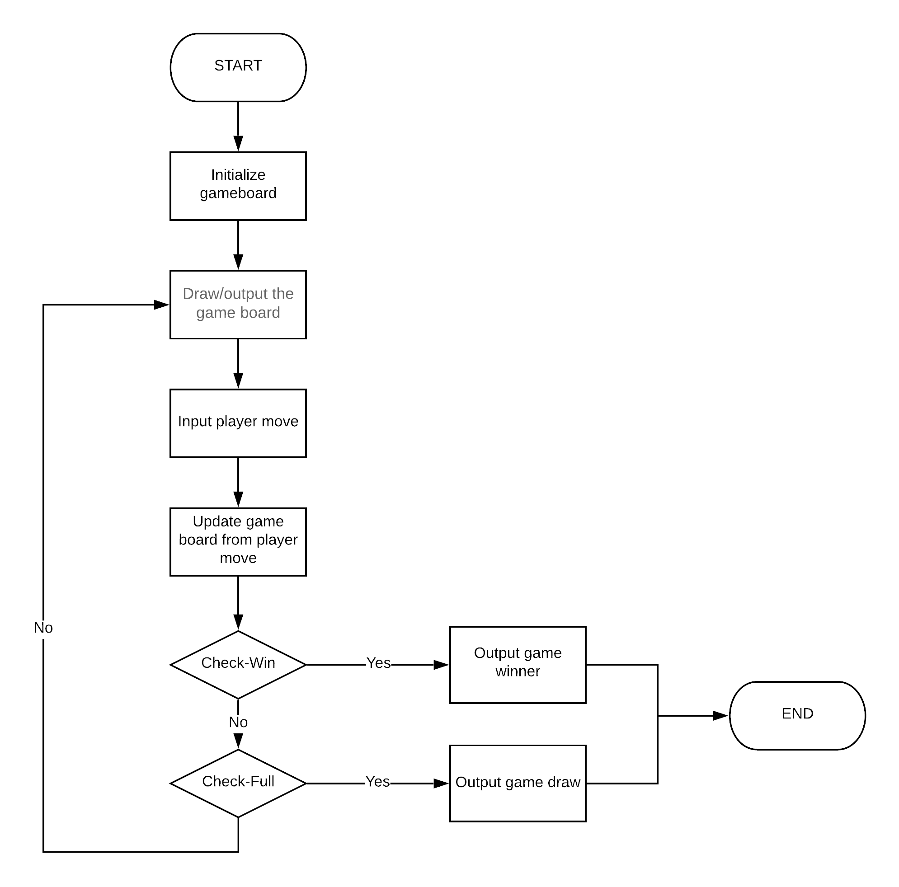

# Rules of Connect4:

- The first player starts Connect Four by dropping one of their yellow discs into the center column of an empty game board. The two players then alternate turns dropping one of their discs at a time into an unfilled column, until the second player, with red discs, achieves a diagonal four in a row, and wins the game. For games where the board fills up before either player achieves four in a row, then the games are a draw

# Game structure:

# Module prototypes/global variables:

| **Variable name** | **Type** | **Description** |
| --- | --- | --- |
| **Game\_board** | `ARRAY[7][6]` | Lorem ipsum dolor sit amet, consectetur adipiscing elit, sed do eiusmod tempor incididunt ut labore et dolore magna aliqua. Viverra orci sagittis eu volutpat odio facilisis mauris. Mattis rhoncus urna neque viverra justo. Venenatis tellus in metus vulputate. |
| **Moves\_so\_far** | `INTEGER` | Lorem ipsum dolor sit amet, consectetur adipiscing elit, sed do eiusmod tempor incididunt ut labore et dolore magna aliqua. Viverra orci sagittis eu volutpat odio facilisis mauris. Mattis rhoncus urna neque viverra justo. Venenatis tellus in metus vulputate. |

| **Module/function name** | **Parameters** | **Return values** | **Description** |
| --- | --- | --- | --- |
| **init\_game\_board()** | **game\_board:** `ARRAY[7][6]` as `GLOBAL (by reference)` | `VOID` | Lorem ipsum dolor sit amet, consectetur adipiscing elit, sed do eiusmod tempor incididunt ut labore et dolore magna aliqua. Viverra orci sagittis eu volutpat odio facilisis mauris. Mattis rhoncus urna neque viverra justo. Venenatis tellus in metus vulputate. |
| **draw\_game\_board()** | **game\_board:** `ARRAY[7][6]` as `LOCAL (by value)` | `VOID` | Lorem ipsum dolor sit amet, consectetur adipiscing elit, sed do eiusmod tempor incididunt ut labore et dolore magna aliqua. Viverra orci sagittis eu volutpat odio facilisis mauris. Mattis rhoncus urna neque viverra justo. Venenatis tellus in metus vulputate. |
| **input\_player\_move()** | `VOID` | **valid\_player\_move:** `INTEGER` | Lorem ipsum dolor sit amet, consectetur adipiscing elit, sed do eiusmod tempor incididunt ut labore et dolore magna aliqua. Viverra orci sagittis eu volutpat odio facilisis mauris. Mattis rhoncus urna neque viverra justo. Venenatis tellus in metus vulputate. |
| **update\_board\_from\_player\_move()** | **game\_board:** `ARRAY[7][6]` as `GLOBAL (by reference)`     **player\_move:** `INTEGER` as `LOCAL (by value)` | `VOID` | Lorem ipsum dolor sit amet, consectetur adipiscing elit, sed do eiusmod tempor incididunt ut labore et dolore magna aliqua. Viverra orci sagittis eu volutpat odio facilisis mauris. Mattis rhoncus urna neque viverra justo. Venenatis tellus in metus vulputate. |
| **check\_gameboard\_win()** | **game\_board:** `ARRAY[7][6]` as `LOCAL (by value)` | **game\_won:** `BOOLEAN` | Lorem ipsum dolor sit amet, consectetur adipiscing elit, sed do eiusmod tempor incididunt ut labore et dolore magna aliqua. Viverra orci sagittis eu volutpat odio facilisis mauris. Mattis rhoncus urna neque viverra justo. Venenatis tellus in metus vulputate. |
| **check\_game\_board\_full()** | **game\_board:** `ARRAY[7][6]` as `LOCAL (by value)` | **game\_board\_full:** `BOOLEAN` | Lorem ipsum dolor sit amet, consectetur adipiscing elit, sed do eiusmod tempor incididunt ut labore et dolore magna aliqua. Viverra orci sagittis eu volutpat odio facilisis mauris. Mattis rhoncus urna neque viverra justo. Venenatis tellus in metus vulputate. |
| **output\_game\_winner()** | **winning\_player:** `INTEGER` as `LOCAL (by value)` | `VOID` | Lorem ipsum dolor sit amet, consectetur adipiscing elit, sed do eiusmod tempor incididunt ut labore et dolore magna aliqua. Viverra orci sagittis eu volutpat odio facilisis mauris. Mattis rhoncus urna neque viverra justo. Venenatis tellus in metus vulputate. |
